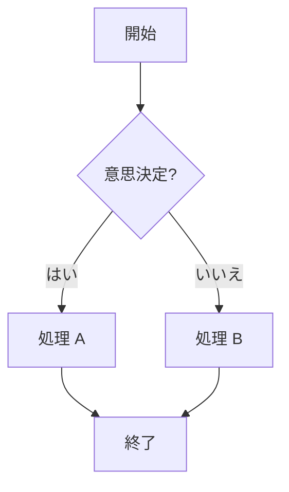
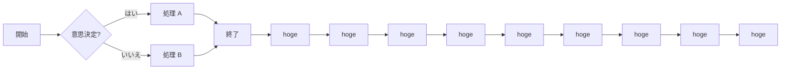
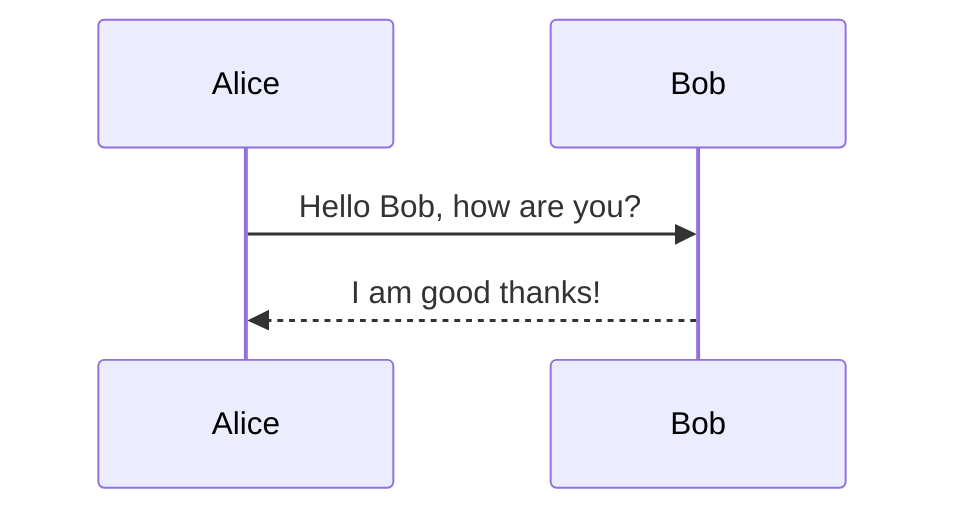
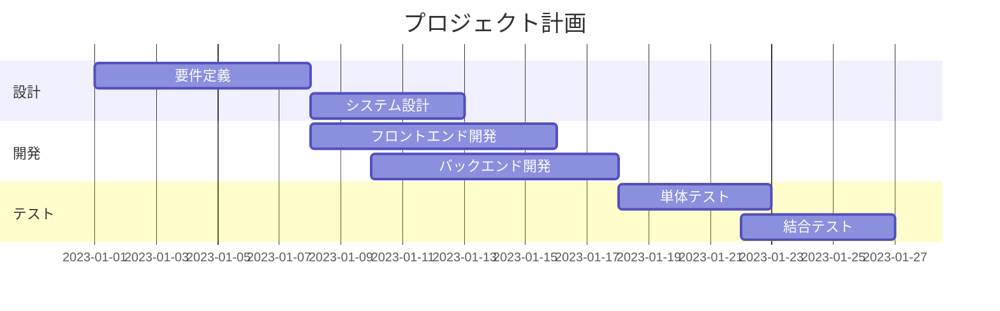

# 🎨 スタイルガイド

Docs内で使用可能な主要なコンポーネントの表示例と、その書き方をまとめました。

---

## 補足情報
重要なポイントや注意点を視覚的に強調します。

---

### 情報
#### 表示例
!!! info "情報"
    これは一般的な情報をお知らせする際に使用します。

#### 書き方
```markdown
!!! info "情報"
    これは一般的な情報をお知らせする際に使用します。
```

---

#### 表示例
!!! warning "注意"
    これはユーザーに注意を促す際に使用します。

#### 書き方
```markdown
!!! warning "注意"
    これはユーザーに注意を促す際に使用します。
```

---

## タブ表示
記載情報にタブで切り替えられるようにしたいときに使用

#### 表示例

=== "Windows"
    `C:\Users\` を開きます。

=== "macOS"
    `/Users/` を開きます。

#### 書き方
```markdown
=== "Windows"
    `C:\Users\` を開きます。

=== "macOS"
    `/Users/` を開きます。
```

---
## アコーディオン
冗長なコンテンツに対して、開閉を切り替えたいときに使用


#### 表示例

??? info "ここをクリックすると開きます"
    中身の詳細テキストです。
    コードブロックや画像もこの中に入れられます。

#### 書き方
```markdown
??? info "ここをクリックすると開きます"
    中身の詳細テキストです。
    コードブロックや画像もこの中に入れられます。
```

---

#### 表示例

???+ info "ここをクリックすると開きます"
    中身の詳細テキストです。
    コードブロックや画像もこの中に入れられます。

#### 書き方
```markdown
???+ info "ここをクリックすると開きます"
    中身の詳細テキストです。
    コードブロックや画像もこの中に入れられます。
```

---

# 📊 フローチャートの例

ここではMermaidを使って簡単なフローチャートを表示します。





---

# シーケンス図の例




---

# 📈 ガントチャートの例


